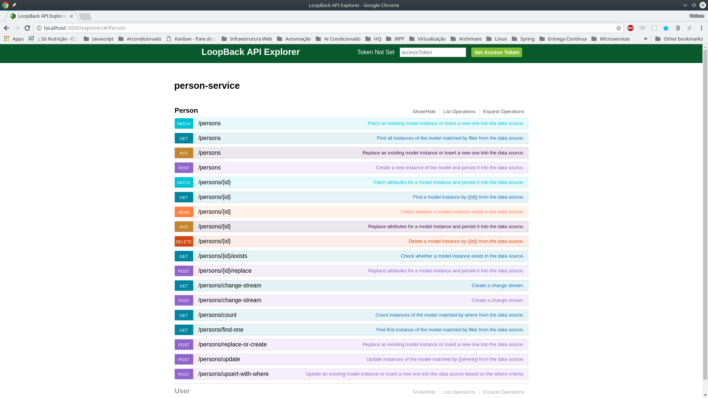

# Person Service

**person-service** é um projeto em NodeJS para simular a API REST do domínio Person.

O [Loopback 3](https://loopback.io/) oferece uma API rica de acordo com o domínio declarado em arquivos JSON:

```json
{
  "name": "Person",
  "plural": "persons",
  "forceId": false,
  "remoting" : {
    "normalizeHttpPath" : true
  },
  "properties": {
    "id": {
      "type": "number",
      "required": true,
      "id": true
    },
    "password": {
      "type": "string",
      "required": true
    },
    "name": {
      "type": "string"
    },
    "email": {
      "type": "string"
     },
    "telephone": {
      "type": "string"
    }
  }
}
```

A API criada pode ser consultada por meio do Swagger embarcado na aplicação no endereço **http://localhost:3000/explorer**.



## Iniciando o projeto

```bash
# Instalação dos módulos NodeJS
npm install

# Iniciando projeto
npm start
```

## Persistência de dados

Os dados são persistidos em arquivo: `<raiz_do_projeto>/data/db.json`.

Para persistência em outros bancos de dados vide [documentação do Loopback](http://loopback.io/doc/en/lb3/Defining-data-sources.html)
